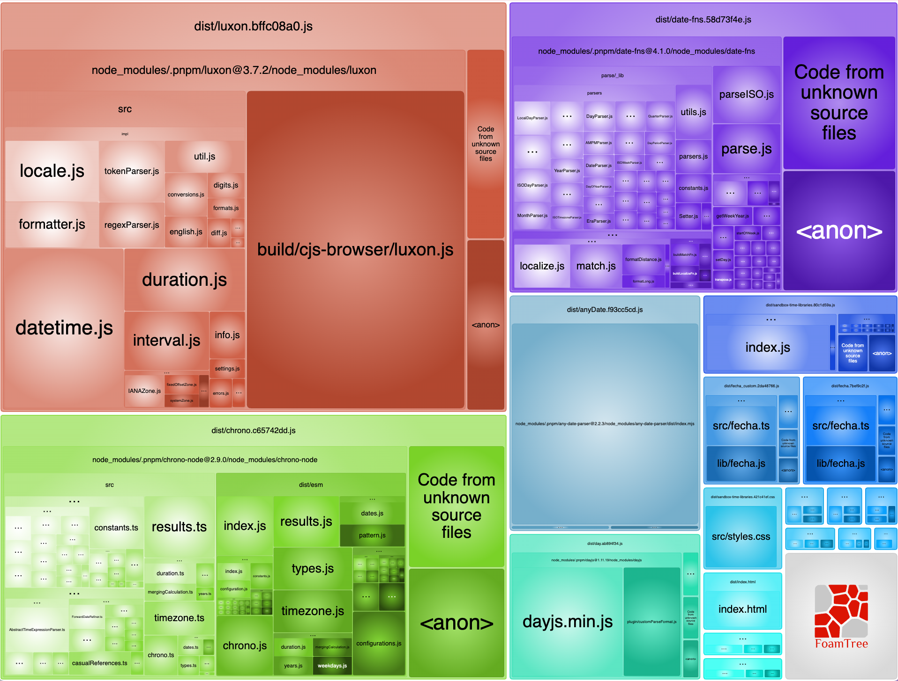

# sandbox-time-libraries

[English version](README.en.md)

Benchmark interactivo que compara **6 librerías de JavaScript** para convertir strings de fechas en objetos `Date`. El objetivo es evaluar qué tan bien cada librería maneja una variedad de formatos de fecha comunes, y cuánto espacio ocupa en el bundle final.

## Librerías evaluadas

| Librería | Versión | Enfoque |
|----------|---------|---------|
| [DayJS](https://day.js.org/) | 1.11.19 | Ligera, con plugin `customParseFormat` para parsing con formatos explícitos |
| [Chrono-node](https://github.com/wanasit/chrono) | 2.9.0 | Parsing de lenguaje natural (NLP) |
| [Any-Date-Parser](https://github.com/kensnyder/any-date-parser) | 2.2.3 | Detección automática de formatos |
| [date-fns](https://date-fns.org/) | 4.1.0 | Funciones modulares de utilidad, parsing con formatos explícitos |
| [Fecha](https://github.com/taylorhakes/fecha) | 4.2.3 | Micro-librería de parsing y formateo |
| [Luxon](https://moment.github.io/luxon/) | 3.7.2 | Sucesor espiritual de Moment.js, API rica con soporte ISO/RFC/SQL |

## Casos de prueba

Todas las cadenas deben resolverse a la fecha **`2024-03-15`**:

| # | Formato | Cadena de prueba |
|---|---------|-----------------|
| 1 | ISO 8601 | `2024-03-15` |
| 2 | US slash (MM/DD/YYYY) | `03/15/2024` |
| 3 | EU slash (DD/MM/YYYY) | `15/03/2024` |
| 4 | US hyphen (MM-DD-YYYY) | `03-15-2024` |
| 5 | EU hyphen (DD-MM-YYYY) | `15-03-2024` |
| 6 | US short (M/D/YYYY) | `3/15/2024` |
| 7 | EU short (D/M/YYYY) | `15/3/2024` |
| 8 | ISO slash (YYYY/MM/DD) | `2024/03/15` |
| 9 | EU dot (DD.MM.YYYY) | `15.03.2024` |
| 10 | Mes abreviado | `Mar 15, 2024` |
| 11 | Mes completo | `March 15, 2024` |
| 12 | Día primero abreviado | `15 Mar 2024` |
| 13 | Día primero completo | `15 March 2024` |
| 14 | Japonés | `2024年3月15日` |
| 15 | Compacto | `20240315` |

## Resultados

Cada librería se prueba en dos modalidades:

- **Pura**: solo usa la API nativa de la librería (loops de formatos permitidos, sin código custom)
- **Custom** (\*): agrega código custom (regex, swap de valores, etc.) para cubrir los formatos faltantes

### Versiones puras (solo API de la librería)

| Librería | Tests | Formatos fallidos |
|----------|:-----:|-------------------|
| **DayJS** | **15/15** | — |
| Date-fns | 14/15 | Japonés |
| Luxon | 14/15 | Japonés |
| Fecha | 14/15 | Japonés |
| ChronoJS | 13/15 | Japonés, Compacto |
| Any-Date | 12/15 ⚠️ | `15/03/2024`, `15-03-2024`, `15/3/2024` (confunde DD/MM con MM/DD) |

### Versiones con código custom (\*)

| Librería | Tests | Código custom agregado |
|----------|:-----:|------------------------|
| **ChronoJS\*** | **15/15** | Regex para formato japonés y compacto |
| **Any-Date\*** | **15/15** | Parseo manual de formatos con `/` y `-` (ver nota abajo) |
| **Date-fns\*** | **15/15** | Regex para formato japonés |
| **Fecha\*** | **15/15** | Regex para formato japonés |
| **Luxon\*** | **15/15** | Regex para formato japonés |

> DayJS no necesita versión custom porque maneja todos los formatos nativamente con su plugin `customParseFormat`.

### ⚠️ Nota sobre Any-Date-Parser

La librería `any-date-parser@2.2.3` fue compilada con `esbuild --platform=node`. Su función `parser.attempt()` devuelve **resultados inconsistentes entre browsers** para formatos con `/` y `-` (ej: `MM/DD/YYYY`, `DD-MM-YYYY`):

| Entorno | `parser.attempt("03/15/2024")` |
|---------|-------------------------------|
| Node.js | `{month: 3, day: 15, year: 2024}` ✅ |
| Cursor Browser (Electron) | `{month: 3, day: 15, year: 2024}` ✅ |
| Chrome | `{year: 2024, day: 3, month: 1}` ❌ |

Por esta razón, la versión custom (`anyDate_custom.js`) parsea manualmente los formatos `XX/XX/YYYY` y `XX-XX-YYYY` sin depender de la librería para esos patrones.

## Costo de bundle (code-splitting)

Cada librería se carga como un chunk separado via `import()` dinámico. El bundle principal pesa solo **~3.2 KB**. Cada librería se descarga únicamente cuando el usuario hace clic en su botón.

| Chunk | Tamaño (min) |
|-------|:------------:|
| Luxon | 82.5 KB |
| Chrono-node | 53.5 KB |
| date-fns | 45.0 KB |
| Any-Date-Parser | 18.2 KB |
| DayJS | 11.3 KB |
| Fecha | 4.3 KB |

La siguiente imagen muestra el treemap generado por `@parcel/reporter-bundle-analyzer` (antes del code-splitting), donde el tamaño de cada bloque es proporcional a su contribución al bundle:



## Veredicto

| | Mejor versatilidad | Menor tamaño |
|---|:---:|:---:|
| **Librería** | **DayJS** | **Fecha** |
| Tests (pura) | 15/15 | 14/15 |
| Chunk | 11.3 KB | 4.3 KB |
| Custom necesario | No | Solo regex para japonés |

**DayJS** es la ganadora en versatilidad: pasa los 15 tests sin ningún código custom, su plugin `customParseFormat` soporta nativamente todos los formatos incluyendo japonés (`YYYY年M月D日`) con solo agregar el formato al loop. Su bundle de 11.3 KB es razonable para lo que ofrece.

**Fecha** es la opción más liviana con solo 4.3 KB de bundle. Pasa 14/15 tests de forma pura y solo necesita un pequeño regex para el formato japonés en su versión custom. Si el tamaño del bundle es la prioridad y los formatos requeridos son conocidos, Fecha es la mejor opción.

Las demás librerías tienen trade-offs que las hacen menos atractivas para este caso de uso: **Luxon** (82.5 KB) y **date-fns** (45 KB) son significativamente más pesadas para lograr lo mismo, **Chrono-node** (53.5 KB) es ideal solo si se necesita NLP, y **Any-Date-Parser** (18.2 KB) tiene un bug cross-browser documentado que lo hace poco confiable.

## Estructura del proyecto

```
src/
├── index.js            # Orquestador: code-splitting, UI, test runner
├── testDates.js        # Datos de prueba y fecha esperada
├── styles.css          # Estilos
│
│  Versiones puras (solo API de la librería + loop de formatos)
├── day.js              # DayJS (15/15)
├── chrono.js           # Chrono-node (13/15)
├── anyDate.js          # Any-Date-Parser (12/15 ⚠️)
├── date-fns.js         # date-fns (14/15)
├── fecha.js            # Fecha (14/15)
├── luxon.js            # Luxon (14/15)
│
│  Versiones custom (código adicional para cubrir formatos faltantes)
├── chrono_custom.js    # + regex japonés y compacto (15/15)
├── anyDate_custom.js   # + parseo manual de / y - (15/15)
├── date-fns_custom.js  # + regex japonés (15/15)
├── fecha_custom.js     # + regex japonés (15/15)
└── luxon_custom.js     # + regex japonés (15/15)
```

## Ejecución

```bash
# Instalar dependencias
pnpm install

# Iniciar servidor de desarrollo
pnpm start

# Build de producción
pnpm build

# Build + análisis de bundle (genera parcel-bundle-reports/default.html)
pnpm analize
```
